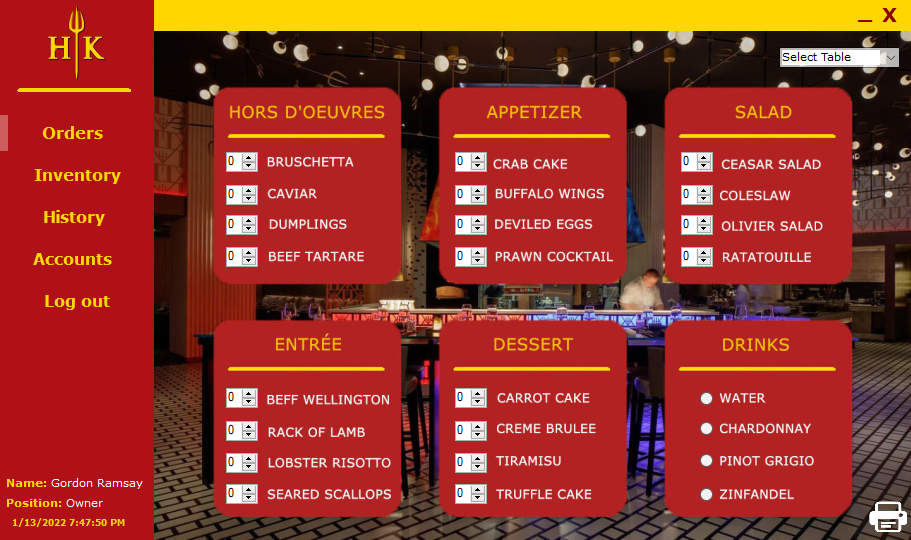
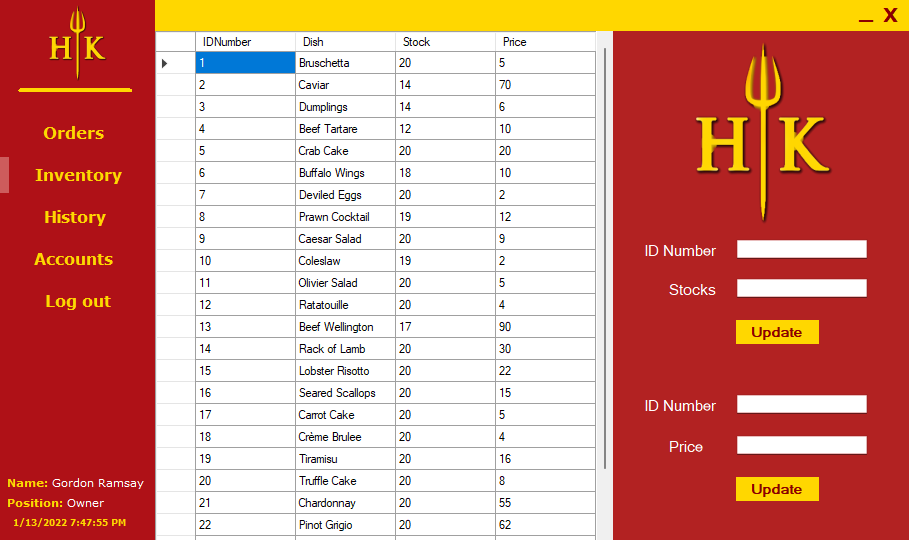
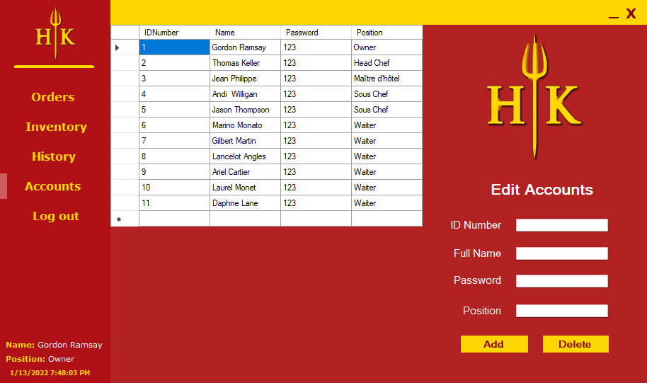

# Hells-Kitchen-POS

This Repo is my Final project in first year IT course in college.\
I created this at that time I'm hooked watch Hells Kitchen on youtube.\
This project got perfect score, because my teacher didnt expect someone can make a fully functioning POS but I did hehehe.\
To open this project please download this repo open >> Point of Sale\bin\Debug and click the "Point of Sales.exe"\
To log in use one account in the "HKDatabes.mdb" in the same folder.

